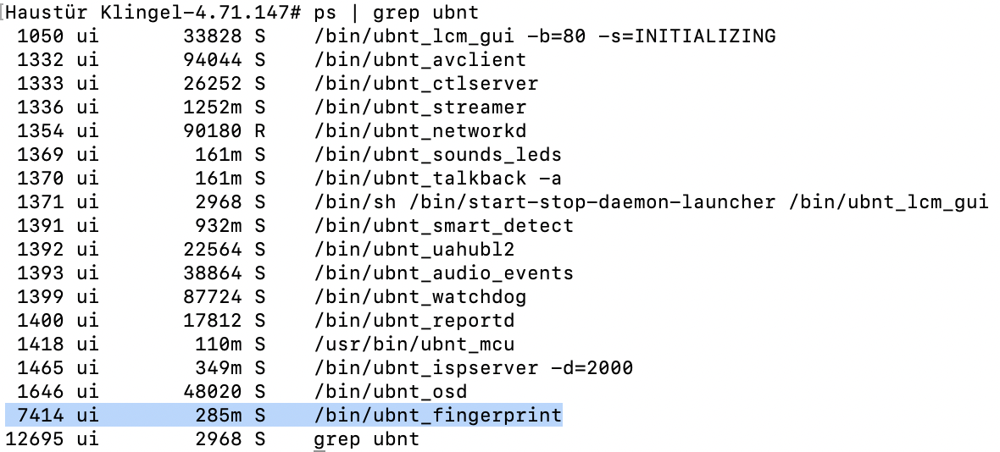
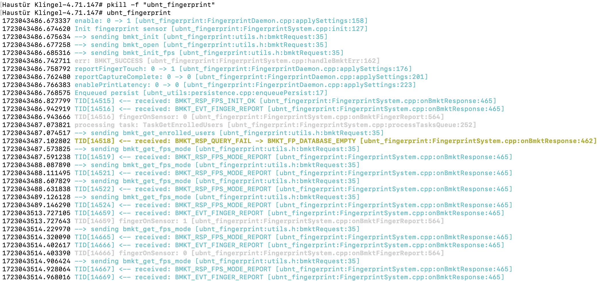

# UnifiG4DoorbellPro-Investigation
## Preamble
The Unifi Doorbell G4 Pro was announced in early access with an integrated fingerprint sensor and an nfc reader and some other features like custom animations when the display is turned on. (Citation needed)

While some features like the cutsom animations have since been released (citation needed), the fingerprint sensor and the nfc reader are still not integrated with unifi protect or access nor are they accessable in any other way. Some people even have rumored that the hardware for the sensor and reader aren't evene in the doorbell anymore.

Since i bought the doorbell - in parts -  because i wanted to integrate the sensor or the reader with my motorized front door I started investigating on the software side.
In the following you will find my current findings. Contributions from others are welcome.


## Fingerprint Sensor
The fingerprint sensor is, not as rumored, present in the hardware of the doorbell positioned right above the package camera. As you can see in the following the doorbell even registeres touching the fingerprint sensor.

### unifi-fingerprint process
Among other special Ubiquity applications the doorbell has a program called ```ubnt_fingerprint``` which is automatically started on boot and restarted when killed.



When fast enough kiilling the process and starting it manually lets you see the output of the process:



As visible, I put my finger on the sensor and it confirms with ```fingerOnSensor: 1```. The process sometimes crashes without doing anything. 

## Additional Hardware
As searching through the ```/dev```and ```/bin/```directories I noticed two tools. The ```tsensor_ctrl``` and ```lsensor_ctrl``` utilities. Unfortunately i haven't been able to get them to work.

more to come...

### tsensor_ctrl
The former talks to an internal temperature sensor which is a G753 ([Datasheet](http://www.gmt.com.tw/product/datasheet/EDS-753.pdf)) on the SMBus. 

### lsensor_crtl
The one talks to a internal light sensor, according to the utility itself a CG5162LC ([Info](https://www.ever-full.com/en/products/ambient-light-sensor/)).

## NFC Reader
Coming soon...
